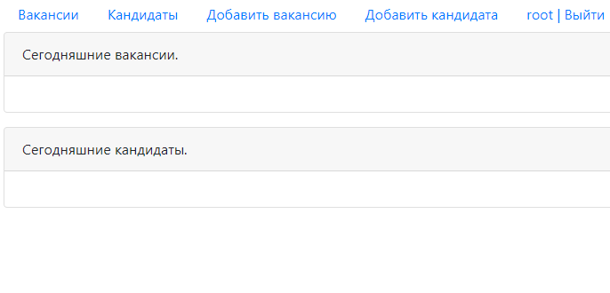
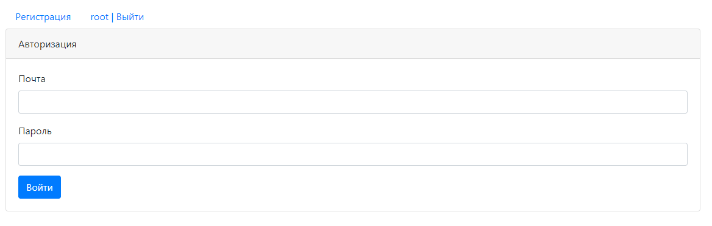
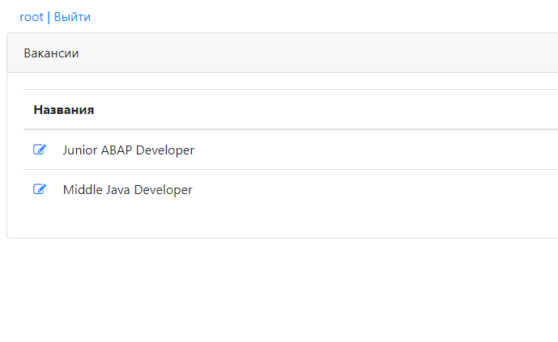
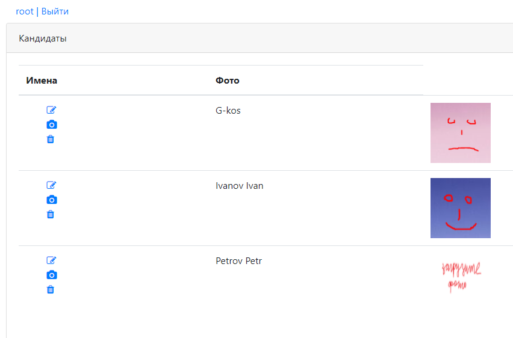
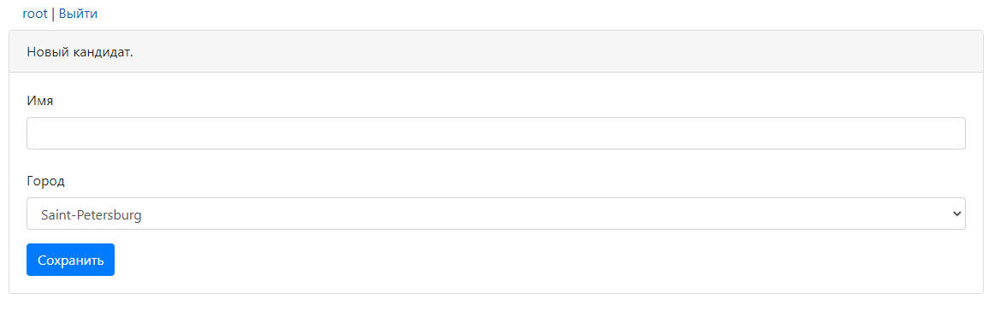

# job4j_dreamjob

**Биржа работы**

В системе есть два типа пользователей: кандидаты и кадровики.
 Кандидаты публикуют резюме.
Кадровики публикуют вакансии о работе.

## Возможности

*Стартовая страница*  

*Регистрация или авторизация пользователя*  

*Список вакансий*  

*Список кандидатов*  

*Редактирования существующей информации о вакансии или для создания новой*  

*Редактирования существующей информации о кандидате или для создания новой*  

